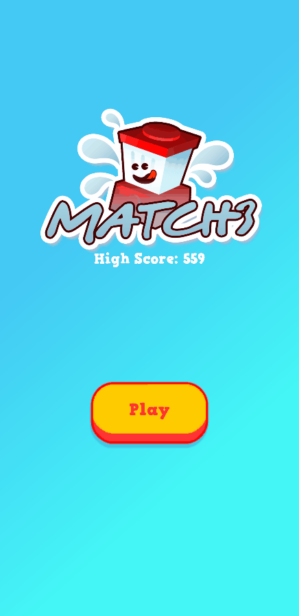
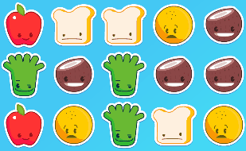
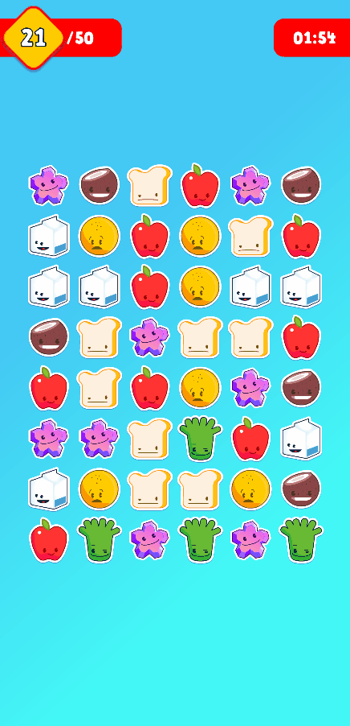
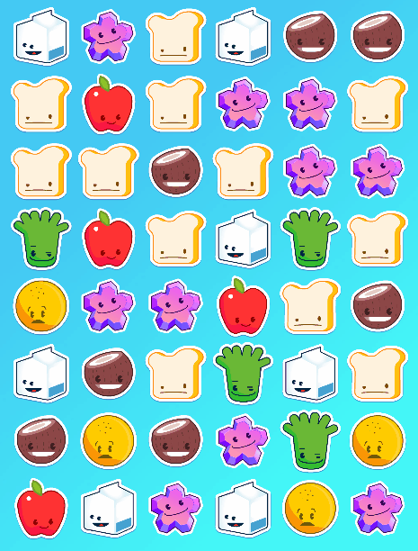
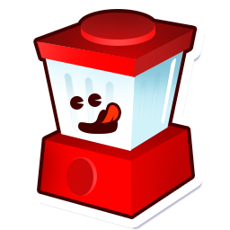

  
  Jogo Combine 3, desenvolvido na Unity.

## 📑 Indíce

- [📜 Sobre](#-sobre)
- [💻 Tecnologias](#-tecnologias)
- [⚠️ Instalação](#%EF%B8%8F-instalação)
- [💡 Features Adicionais](#-features-adicionais)
- [📦 Builds](#-builds)

## 📜 Sobre

Clássico jogo de combinar 3, desenvolvido para o desafio proposto pela [PlayKids](https://playkids.com/). Segue o escopo solicitado:

- Combine 3 ou mais itens (linhas ou colunas) para destruí-los.
- Ganhe pontos por cada combinação.
- Atinja a pontuação determinada antes do tempo (2 min) acabar. Sempre que alcançar o objetivo, incrementa-lo e reiniciar o contador de tempo.
- A cada combinação, os itens descem para ocupar as posições vazias, e novos itens são criados no topo.
- Embaralhar o tabuleiro, caso não exista possibilidades.
- Utilizar os assets disponibilizados.
- Os elementos visuais devem funcionar em diferentes resoluções em modo retrato (Portrait).
- Ser desenvolvido em C# utilizando Unity na versão 2018 ou superior.

## 💻 Tecnologias

- C#
- Unity (version: [2019.3.13f1](https://unity3d.com/pt/get-unity/download/archive?_ga=2.118344778.2126703189.1592841786-2050972297.1592582956))

## ⚠️ Instalação

Ao abrir o projeto na Unity, certifique-se de instalar os requerimentos do plugin TextMesh Pro:

    Window -> TextMeshPro -> Import TMP Essential Resources

Este plugin foi utilizado para os componentes de texto.

Para mais informações sobre o plugin acesse: https://docs.unity3d.com/Packages/com.unity.textmeshpro@2.0/manual/index.html

## 💡 Features Adicionais

### Highscore

A pontuação mais alta fica armazenada, sendo apresentada na tela principal.

### Dicas

Depois de um tempo sem combinações, o jogo sugestiona uma possibilidade.

### Combos

Combinações seguidas adicionam um multiplicador a pontuação recebida.

### Item especial

Uma combinação em ambas as direções, cria um item especial, Liquidificador. Ele combina com a linha e coluna completa em que for movido.

### Artes adicionais

As artes do liquidificador e da logo foram criadas e disponibilizadas pelo incrível Ilustrador e UX/UI Designer [Yarick Ivens](https://www.behance.net/yarickivens)!

  

## 📦 Builds

O jogo está disponível nas seguintes plataformas:

- [🌐 Web (WebGL)](https://diegomoreira.dev/match-3-unity/)
- [📱 Mobile (Android)](https://bit.ly/match-3-game)

---

  
Desenvolvido por 🤘 Diego Moreira

   
  
  

